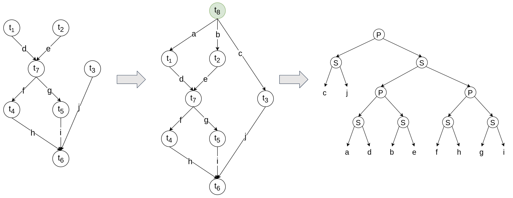
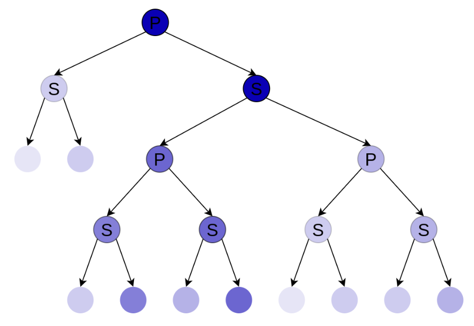
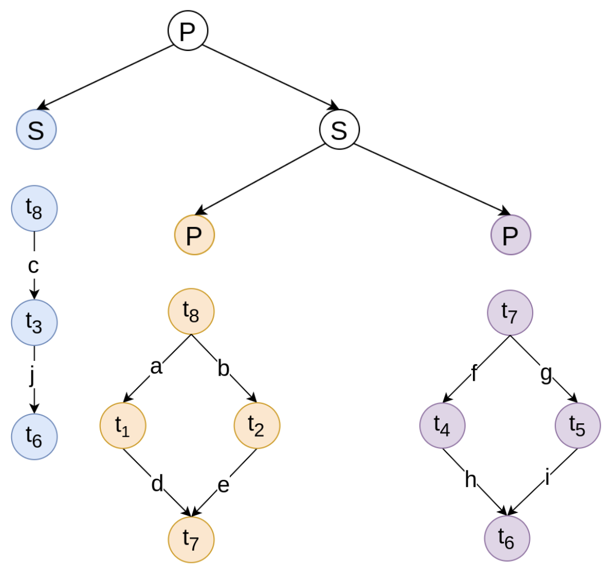

# Workflow Decomposition Algorithm

Workflow Decomposition Algorithm helps in scheduling big workflows on solvers with limited capacity, such as
the [CQM](https://docs.ocean.dwavesys.com/en/stable/docs_dimod/reference/models.html#module-dimod.constrained.constrained)
hybrid (quantum-classical) sampler. It splits workflows into independent
problems, that can be solved separately and partial results be merged into the final schedule.

## Assumptions

Algorithm has been designed with the following assumptions:

* Workflow - is expressed as a DAG, where each vertex has its with workload. Edges impose an order on workflow
  execution.
* Environment - contains finite set of machines types, available on demand, that are used to schedule tasks. Time and
  cost of running task `t` on machine `m` are know a priori.
* Constraints - workflow must be executed before the **deadline** and each task must be scheduled on a **single**
  machine.
* Goal - scheduling aims to minimize the overall **cost**, with respect to the constraints.

## How does it work

### Workflow transformation

Decomposition starts with the transformation of a workflow to
the [series-parallel graph](https://en.wikipedia.org/wiki/Series%E2%80%93parallel_graph) (SP). Mapping is based on the
algorithm proposed in [this paper](https://link.springer.com/chapter/10.1007/3-540-36569-9_27). Each SP graph can be
equally expressed by its binary decomposition tree, that can be built in linear time
using [this method](https://dl.acm.org/doi/10.1145/800135.804393).


### Weight assignment

Weights are associated with workload and are calculated for each node in the binary decomposition tree. Tree root's
weight represent workload for the whole workflow, whereas leaf's weight for the single edge.


### Deadline distribution

In the assumed model every workflow needs a deadline to be scheduled. Weights calculated in the previous step are used
to propagate the deadline over decomposition tree.

### Tree pruning

In the final step, independent workflows are extracted from the tree using the pruning method. User defines a pruning
border, which is expressed as the expected number of tasks in each resulting subworkflow. Leaves of the pruned tree
represent parts of a decomposed workflow, that have its own deadline and can be scheduled independently.


### Merging results

After scheduling, there can be a conflict in machine assignment for task `t` between two subworkflows. In such case,
faster machine needs to be selected, to ensure that the deadline is met.

## Integration with QHyper

The easiest way to have the hands-on experience with workflow decomposition is by utilizing
the [QHyper](https://github.com/qc-lab/QHyper).

```python
from QHyper.problems.workflow_scheduling import Workflow, WorkflowSchedulingOneHot
from decomposition.qhyper.algorithm import WorkflowDecompositionQHyperAdapter
from decomposition.qhyper.solver import DecomposedWorkflowSchedulingSolver, WorkflowSchedulingSolverDecorator
from QHyper.solvers import Gurobi

# load workflow
workflow = Workflow(tasks_file, machines_file, deadline)

# prepare solver
division = WorkflowDecompositionQHyperAdapter(workflow).decompose(max_subgraph_size)
problems = map(lambda w: WorkflowSchedulingOneHot(w), division.workflows)
solvers = map(lambda p: WorkflowSchedulingSolverDecorator(Gurobi(p)), problems)
solver = DecomposedWorkflowSchedulingSolver(list(solvers), division)

# schedule workflow
solution = solver.solve()
```